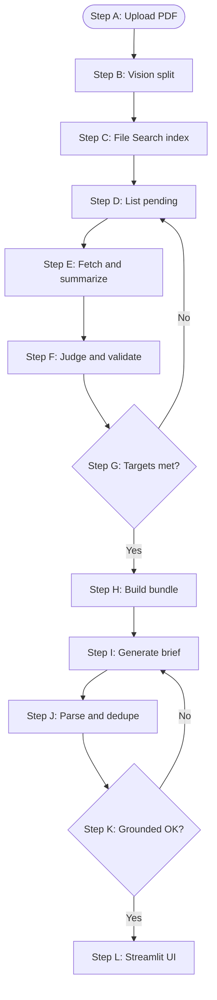

# Agentic Music Analytics Pipeline

An agentic AI pipeline that turns music industry PDFs into grounded insights and executive recommendations. A ReAct agent decides which report sections to read, when to judge them, and when it has enough evidence. LangGraph orchestrates the full run. The demo streams the agent's reasoning live in the UI.

Live demo: [music-agentic-analytics.streamlit.app](https://music-agentic-analytics.streamlit.app/)

> Note: Demo runs depend on model and resource availability at execution time. If a run fails or stalls, wait and try again after a while. See the [pipeline flow](#pipeline-flow) below for how the app works.

## Pipeline flow



| Step | Phase | What happens |
| --- | --- | --- |
| A | Ingest | User uploads PDF |
| B | Ingest | Vision LLM splits into subsections |
| C | Ingest | File Search indexes each subsection |
| D-G | Analysis | ReAct loop: list, fetch, judge until targets met |
| H-K | Strategy | Bundle insights, generate brief, parse, grounded check |
| L | UI | Insight cards, ReAct trace, recommendations |

The ReAct trace streams during the run and persists in the "How the AI reached these insights" expander.

## Vision splitting

PyMuPDF renders the PDF to page images; Gemini vision returns section titles and start pages; the pipeline cuts mini-PDFs and indexes them in File Search ([`section_splitter.py`](src/services/section_splitter.py)). LLM model: `gemini-2.5-flash`. Details: [`docs/Documentation.md`](docs/Documentation.md).

## How it works

The analysis stage is a ReAct agent (Reason + Act) built with LangChain's `create_agent`. The LLM runs a loop:

1. *Observe* pending subsections in the report manifest.
2. *Act* by calling tools (list, fetch, judge, finish).
3. *Reason* over tool output and decide what to do next.
4. *Stop* when the strategic focus target is satisfied (one accepted DTC or IP hit).

Each tool call can trigger nested LLM work (RAG retrieval, neutral summary, judge, validator). The agent picks which subsections to examine and in what order.

The strategy stage is a LangGraph pipeline with a conditional retry: if recommendations fail a grounded check, the graph loops back for one regeneration pass.

## Agent tools

The analysis agent (`src/agents/analysis/react_agents.py`) picks from these tools (`react_tools.py`):


| Tool                                                              | What the agent uses it for                                               |
| ----------------------------------------------------------------- | ------------------------------------------------------------------------ |
| `list_pending_subsections`                                        | See which subsections have not been judged yet                           |
| `fetch_and_summarize_subsection`                                  | RAG retrieval + neutral executive summary for one subsection             |
| `judge_section_dtc` / `judge_section_ip` / `judge_section_dtc_ip` | Classify fit for the current strategic focus (includes a validator pass) |
| `finish`                                                          | Check whether mode targets are met; stop or keep scanning                |


The demo UI exposes Fan & audience (DTC) or Catalog & IP focus. The agent keeps scanning until it finds an accepted hit for that target.

## LangGraph orchestration

Two compiled graphs drive the pipeline:


| Graph               | Role                                                                                    |
| ------------------- | --------------------------------------------------------------------------------------- |
| `analysis_graph.py` | Routes to ReAct nodes (demo) or parallel summarize + batch label (full profile via env) |
| `strategy_graph.py` | Bundle accepted insights → strategy LLM → postprocess → grounded check                  |


Public entry points: `run_analysis()` and `run_strategy()` in `src/pipelines/`.

A full profile path (`PIPELINE_RUN_PROFILE=full`) runs parallel summarization and batch labeling instead of ReAct. The demo UI uses the ReAct path.

## Tech stack


| Layer         | Technology                                    |
| ------------- | ---------------------------------------------- |
| Agents        | LangChain ReAct (`create_agent`) + tool loop  |
| Orchestration | LangGraph (analysis + strategy graphs)        |
| LLM           | Google Gemini                                 |
| RAG           | Gemini File Search                            |
| UI            | Streamlit (live agent trace, executive cards) |
| PDF           | PyMuPDF + Gemini vision                       |
| Tests         | pytest (49 tests, mocked agents/graphs)       |


## Quick start

### Prerequisites

- Python 3.10+
- A [Google AI Studio](https://aistudio.google.com/) API key

### Setup

```bash
git clone https://github.com/a-partha/music_analytics_app.git
cd music_analytics_app
python -m venv .venv
.venv\Scripts\activate        # Windows
# source .venv/bin/activate   # macOS / Linux
pip install -r requirements.txt
```

Create a `.env` file in the project root:

```env
GEMINI_API_KEY=your_key_here
```

Optional model overrides:

```env
GEMINI_ANALYSIS_MODEL=gemini-3.1-flash-lite   # ReAct agent, summaries, labels
GEMINI_STRATEGY_MODEL=gemini-3.1-pro          # executive brief
GEMINI_MODEL=gemini-2.5-flash                 # optional: vision split + File Search retrieval
GEMINI_SYNTHESIS_MODEL=gemini-3.1-flash-lite  # optional: alias for analysis model in cache keys
```

### Run locally

```bash
python scripts/run.py
```

Or:

```bash
streamlit run app/streamlit_app.py
```

Choose a strategic focus, upload a PDF, and run analysis. Sample PDFs are in [docs/](docs/).

## Demo UI


| Control                  | Behavior                                             |
| ------------------------ | ---------------------------------------------------- |
| Strategic focus          | DTC or IP (required before run)                      |
| Combined DTC+IP          | Shown but disabled (resource limits)                 |
| Run analysis             | Starts the ReAct agent loop over indexed subsections |
| ReAct trace              | Live tool calls and reasoning during the run         |
| Generate executive brief | Runs the strategy LangGraph on accepted insights     |


## Repo layout

```text
app/streamlit_app.py          # Demo UI + live ReAct trace
src/
  config/                     # RunProfile, AnalysisMode
  agents/analysis/            # ReAct agents, tools, trace formatter
  agents/strategy/            # Strategy graph nodes + postprocess
  graphs/                     # analysis_graph, strategy_graph
  chains/                     # LCEL chains used inside agent tools
  pipelines/                  # run_analysis, run_strategy
  services/                   # File Search, splitter, cache
  tools/                      # retrieval tools
  validation/                 # pytest suite (agent + graph mocks)
docs/                         # Documentation + sample PDFs
scripts/run.py                # Streamlit launcher
scripts/create_file_search_store.py
.streamlit/config.toml        # Theme + upload limit
```

## API usage

After PDF split and File Search upload (see `app/streamlit_app.py`):

```python
from src.pipelines.analysis_pipeline import run_analysis
from src.pipelines.strategy_pipeline import run_strategy

dtc_results, ip_results, section_results, labeled_rows = run_analysis(
    file_search_store_name=store_name,
    manifest=manifest,
    source_filename="report.pdf",
    analysis_mode="dtc_only",  # or "ip_only", "both"
    react_messages_out=[],     # capture agent trace
)
recommendations = run_strategy(dtc_results=dtc_results, ip_results=ip_results)
```

## Tests

```bash
pytest
```

Tests in `src/validation/` mock ReAct agents and LangGraph nodes. No API key required.

## Deployment

Hosted on [Streamlit Community Cloud](https://music-agentic-analytics.streamlit.app/). Set `GEMINI_API_KEY` in Streamlit secrets. Cloud disk is ephemeral, so caches don't persist across restarts/redeploys; each session may re-upload subsections to File Search.

## Documentation

Full agent design, LLM stage reference, and config details:

[docs/Documentation.md](docs/Documentation.md)