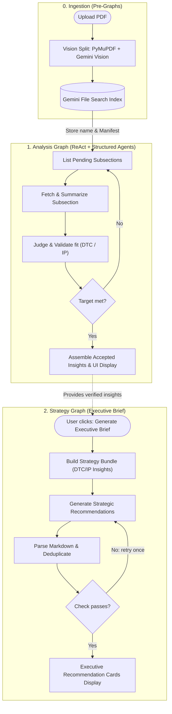

# Agentic Music Analytics Pipeline

An agentic AI pipeline that turns music industry PDFs into grounded insights and executive recommendations. A ReAct agent decides which report sections to read, when to judge them, and when it has enough evidence. LangGraph orchestrates the full run. The demo streams the agent's reasoning live in the UI.

Live demo: [music-agentic-analytics.streamlit.app](https://music-agentic-analytics.streamlit.app/)

> Note: Demo runs depend on model and resource availability at execution time. If a run fails or stalls, wait and try again after a while. See the [pipeline flow](#pipeline-flow) below for how the app works.

### Strategic focus and two-tier architecture

Every subsection is classified into a single domain focus:
- **DTC (Direct-to-Consumer)**: Fan engagement, superfans, short-form video, social media and gaming music, podcasts, merch, ticketing, direct artist-to-fan monetization.
- **IP (Intellectual Property)**: Catalog age and valuation, rights splits, export flows, domestic vs. foreign streaming, territory charts, cross-border genre trends.

The application operates as a **two-tier architecture**:
1. **Analysis layer**: Extracts grounded, verbatim excerpts and produces section-by-section verified summaries.
2. **Strategy layer**: Synthesizes verified insights into high-level, executive briefs without drowning C-suite in multi-page excerpt dumps. Verbatim citations remain accessible in the Analysis layer for backtracing.

---

## Pipeline flow


```mermaid
flowchart TB
    subgraph IngestionPipeline ["0. Ingestion (Pre-Graphs)"]
        A(["Upload PDF"]) --> B["Vision Split: PyMuPDF + Gemini Vision"]
        B --> C[("Gemini File Search Index")]
    end

    subgraph AnalysisGraph ["1. Analysis Graph (ReAct + Structured Agents)"]
        D["List Pending Subsections"]
        D --> E["Fetch & Summarize Subsection"]
        E --> F["Judge & Validate fit (DTC / IP)"]
        F --> G{"Target met?"}
        G -->|No| D
        G -->|Yes| H["Assemble Accepted Insights & UI Display"]
    end

    subgraph StrategyGraph ["2. Strategy Graph (Executive Brief)"]
        I(["User clicks: Generate Executive Brief"]) --> J["Build Strategy Bundle (DTC/IP Insights)"]
        J --> K["Generate Strategic Recommendations"]
        K --> L["Parse Markdown & Deduplicate"]
        L --> M{"Check passes?"}
        M -->|No: retry once| K
        M -->|Yes| N["Executive Recommendation Cards Display"]
    end

    C -->|"Store name & Manifest"| D
    H -.->|"Provides verified insights"| I
```

| Phase | Container | What happens |
| --- | --- | --- |
| **Ingestion** | PyMuPDF + Gemini Vision | Renders page images, discovers section boundaries, slices mini-PDFs, and indexes in File Search. |
| **Analysis** | `analysis_graph.py` | ReAct agent scans subsections one by one until finding a validated match for the chosen focus (DTC or IP). |
| **Assembly** | `analysis_graph.py` | Cites verbatim evidence excerpts and formats neutral summary blocks for UI display. |
| **Strategy** | `strategy_graph.py` | Bundles DTC/IP insights, drafts C-suite actions, dedupes recommendations, and runs a grounded retry loop. |
| **UI** | Streamlit | Displays live ReAct trace, categorized insight cards with evidence expanders, and executive brief cards. |

The ReAct trace streams during the run and persists in the "How the AI reached these insights" expander.

---

## Subsystem architecture

### Ingestion and indexing

PyMuPDF renders PDF pages to PNG at 110 DPI. Gemini vision detects subsection boundaries and page ranges, cutting mini-PDF slices indexed in Gemini File Search with metadata (`source_filename`, `subsection_key`) via `src/services/section_splitter.py`. On cache miss, old slice documents matching the source file are pruned via `client.file_search_stores.documents.delete()` before re-indexing to prevent orphaned document bloat.

### LangGraph orchestration

Two compiled graphs drive the pipeline:

| Graph | Role |
| --- | --- |
| `analysis_graph.py` | Routes to ReAct nodes (demo) or parallel summarize + batch label (full profile via env). |
| `strategy_graph.py` | Bundles accepted DTC/IP insights -> strategy LLM -> parse and dedupe -> grounded check. |

Public entry points: `run_analysis()` and `run_strategy()` in `src/pipelines/`.

### ReAct agent and tools

The analysis agent (`src/agents/analysis/react_agents.py`) uses LangChain's `create_agent` and selects tools from `src/agents/analysis/react_tools.py`:

| Tool | What the agent uses it for |
| --- | --- |
| `list_pending_subsections` | See which subsections have not been judged yet. |
| `fetch_and_summarize_subsection` | RAG retrieval + neutral executive summary for one subsection. |
| `judge_section_dtc` / `judge_section_ip` / `judge_section_dtc_ip` | Classify fit for the current strategic focus (includes a validator pass). |
| `finish` | Check whether mode targets are met; stop or keep scanning. |

The demo UI exposes Fan & audience (DTC) or Catalog & IP focus. Combined focus (`both`) is fully implemented in the LangGraph state machine and available via API, but disabled in the free Streamlit Cloud container to prevent HTTP timeouts. The agent keeps scanning until it finds an accepted hit for that target.

---

## Tech stack

| Layer | Technology | Role |
| --- | --- | --- |
| Agents | LangChain ReAct (`create_agent`) + tool loop | Autonomous section selection and judgment loop |
| Orchestration | LangGraph (analysis + strategy graphs) | State-machine coordination, conditional branching, retries |
| LLM | Google Gemini (3.1 Flash-Lite, 3.5 Flash-Lite, 2.5 Pro) | Summaries, labels, vision split, retrieval synthesis, brief |
| RAG | Gemini File Search | Metadata-scoped vector and semantic document retrieval |
| Evaluation | DeepEval + NVIDIA Nemotron-3 Super (120B via NIM) | Component-level factual RAG benchmarking (offline) |
| UI | Streamlit | Theme-aware layout, live agent trace, executive cards |
| PDF | PyMuPDF + Gemini vision | Dynamic PDF section splitting |
| Tests | pytest (67 tests, mocked agents/graphs) | Complete offline unit test coverage |

---

## Quick start

### Prerequisites

- Python 3.10+
- A [Google AI Studio](https://aistudio.google.com/) API key
- An [NVIDIA Build](https://build.nvidia.com/) API key only if you run the evaluation script

### Setup

```bash
git clone https://github.com/a-partha/music_analytics_app.git
cd music_analytics_app
python -m venv .venv
.venv\Scripts\activate        # Windows
# source .venv/bin/activate   # macOS / Linux
pip install -r requirements.txt
```

Create a `.env` file in the project root:

```env
GEMINI_API_KEY=your_gemini_key_here
FALLBACK_MODEL=gemini-3.1-flash-lite   # required: vision split, retrieval, and backup for every unset model
NVIDIA_API_KEY=your_nvidia_key_here    # optional; only for src/validation/evals/run_evals.py
```

No model names are hardcoded. Each per-stage model below falls back to `FALLBACK_MODEL` when unset:

```env
ANALYSIS_MODEL=gemini-3.5-flash-lite                # ReAct agent, summaries, labels, judge, validator
STRATEGY_MODEL=gemini-2.5-pro                       # executive brief
EVAL_GENERATOR_MODEL=gemini-3.5-flash-lite          # eval answers; keep equal to ANALYSIS_MODEL
EVAL_JUDGE_MODEL=nvidia/nemotron-3-super-120b-a12b  # required for the eval; no fallback
# EVAL_RETRIEVAL_MODEL=                             # eval retrieval; unset uses FALLBACK_MODEL
```

### Run locally

```bash
python scripts/run.py
```

Or:

```bash
streamlit run app/streamlit_app.py
```

Choose a strategic focus, upload a PDF, and run analysis. Sample PDFs are in [docs/](docs/).

---

## Demo UI

| Control | Behavior |
| --- | --- |
| Strategic focus | DTC or IP (required before run) |
| Combined DTC+IP | Disabled in demo UI ("resource limits") to prevent free Cloud container timeouts; fully supported in graph state machine and API |
| Run profile | Always `DEV_ONE_PER_CATEGORY`; no dev/full toggle |
| Run analysis | Starts the ReAct agent loop over indexed subsections |
| ReAct trace | Live tool calls and reasoning during the run |
| Download run audit (JSON) | Local, offline snapshot of the run: mode, timings, labeled rows, insights, and full ReAct trace |
| Generate executive brief | Runs the strategy LangGraph on accepted insights |

---

## Repo layout

```text
app/
  streamlit_app.py            # Demo UI + live ReAct trace
src/
  config/                     # RunProfile, AnalysisMode, model resolution
  agents/
    analysis/                 # ReAct agents, tools, trace formatter
    strategy/                 # Strategy graph nodes + postprocess
  graphs/                     # analysis_graph, strategy_graph
  chains/                     # LCEL chains used inside agent tools
  pipelines/                  # run_analysis, run_strategy
  services/                   # File Search, splitter, cache, audit_pack
  tools/                      # retrieval tools
  validation/                 # pytest suite (no network)
    evals/                    # run_evals.py, questions, results, manual review
      archive/                # superseded section-locked baseline 
docs/                         # Documentation + sample PDFs
scripts/
  run.py                      # Streamlit launcher
  create_file_search_store.py # CLI utility to initialize File Search store offline
  sync_manual_review.py       # Sync and verify manual QA evaluation labels
requirements.txt              # Core application dependencies
requirements-eval.txt         # DeepEval + OpenAI client; not installed on Streamlit Cloud
.streamlit/
  config.toml                 # Theme + upload limit
```

---

## API usage

After PDF split and File Search upload (see `app/streamlit_app.py`):

```python
from src.pipelines.analysis_pipeline import run_analysis
from src.pipelines.strategy_pipeline import run_strategy
from src.services.section_cache import hash_pdf_bytes

pdf_hash = hash_pdf_bytes(pdf_bytes)

dtc_results, ip_results, section_results, labeled_rows = run_analysis(
    file_search_store_name=store_name,
    manifest=manifest,
    source_filename="report.pdf",
    pdf_hash=pdf_hash,         # enables disk caching for neutral summaries
    analysis_mode="dtc_only",  # or "ip_only", "both"
    react_messages_out=[],     # capture agent trace
)
recommendations = run_strategy(dtc_results=dtc_results, ip_results=ip_results)
```

---

## Tests and evaluation

Unit tests mock ReAct agents and LangGraph nodes. No API key or `.env` required.

```bash
pytest
```

`[src/validation/evals/run_evals.py](src/validation/evals/run_evals.py)` checks whether the File Search index the app builds can answer factual questions about one report. It does not score the ReAct agent, the DTC/IP judge, or the executive brief. Install its dependencies first, then index `docs/Luminate-2025-Year-End-Music-Report.pdf` once in the local app. A full run takes about 30 minutes with rate limiters enabled.

```bash
pip install -r requirements-eval.txt

# Fresh answers. Retrieval and generation both run live.
python src/validation/evals/run_evals.py

# Same retrieval, but reuse a saved answer when the retrieved text is unchanged.
python src/validation/evals/run_evals.py --use-cache

# Rebuild the summary of testing_report.json. No API calls.
python src/validation/evals/run_evals.py --summarize-only
```

Results are written to `src/validation/evals/testing_report.json`.

Section-locked 25-item run. A metric passes at a score of 0.7 or higher. Cost is a list-price estimate, not an invoice. Details: [docs/Documentation.md](docs/Documentation.md#7-verification-benchmarking-and-telemetry).

| Result | Value |
| --- | --- |
| Faithfulness | 100% (25/25) |
| Answer relevancy | 80% (20/25) |
| Contextual recall | 56% (14/25) |
| All three metrics passed | 56% (14/25) |
| Manual review agreement | 100% (25/25) |
| Total pipeline mean latency | 17,994.12 ms |
| Estimated cost | $0.0797 |

The 56% Contextual Recall score comes from the 9-bullet excerpt: for 11 of 25 questions it contained none of the facts the answer needed. All 5 Answer Relevancy failures are among those 11, where the generator replied that the context had no such information. The 100% Faithfulness score shows the generator declines instead of inventing missing facts.

### Evaluation roadmap

Future benchmarking expands DeepEval coverage across three distinct evaluation tracks:
- **Strategic synthesis**: Evaluating executive brief actionability, relevance, and fidelity to summarized findings in isolation.
- **Agentic trajectories**: Measuring state transitions, ReAct tool selection accuracy, and retry loop behavior (`grounded_check`) across LangGraph executions.
- **End-to-end evaluation**: Testing the full pipeline from raw PDF ingestion through File Search retrieval, summarization, and final C-suite recommendations against ground-truth report metrics.

---

## Deployment

Hosted on [Streamlit Community Cloud](https://music-agentic-analytics.streamlit.app/). Set `GEMINI_API_KEY`, `FALLBACK_MODEL`, `ANALYSIS_MODEL`, and `STRATEGY_MODEL` in Streamlit secrets, using the same model values as `.env`. 

Cloud disk is ephemeral, so local disk caches don't persist across restarts. On a cache miss, the pipeline automatically detects and purges stale slice documents for the PDF via `client.file_search_stores.documents.delete()` before re-indexing, preventing orphaned file bloat in Gemini File Search. Cloud installs `requirements.txt` only, so evaluation dependencies stay off the production container.

---

## Documentation

Full agent design, LLM stage reference, evaluation write-up, and config details:

[docs/Documentation.md](docs/Documentation.md)
