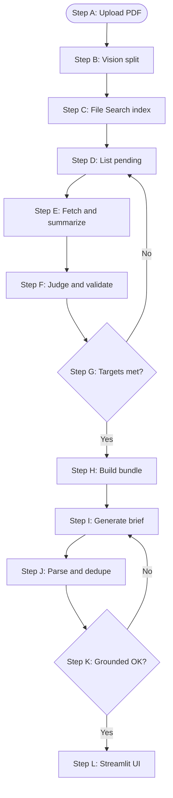

# Agentic Music Analytics Pipeline

An agentic AI pipeline that turns music industry PDFs into grounded insights and executive recommendations. A ReAct agent decides which report sections to read, when to judge them, and when it has enough evidence. LangGraph orchestrates the full run. The demo streams the agent's reasoning live in the UI.

Live demo: [music-agentic-analytics.streamlit.app](https://music-agentic-analytics.streamlit.app/)

> Note: Demo runs depend on model and resource availability at execution time. If a run fails or stalls, wait and try again after a while. See the [pipeline flow](#pipeline-flow) below for how the app works.

## Pipeline flow


```mermaid
flowchart TB
    A(["Step A: Upload PDF"]) --> B["Step B: Vision split"]
    B --> C["Step C: File Search index"]
    C --> D["Step D: List pending"]
    D --> E["Step E: Fetch and summarize"]
    E --> F["Step F: Judge and validate"]
    F --> G{"Step G: Targets met?"}
    G -->|No| D
    G -->|Yes| H["Step H: Build bundle"]
    H --> I["Step I: Generate brief"]
    I --> J["Step J: Parse and dedupe"]
    J --> K{"Step K: Grounded OK?"}
    K -->|No| I
    K -->|Yes| L["Step L: Streamlit UI"]
```

| Step | Phase | What happens |
| --- | --- | --- |
| A | Ingest | User uploads PDF |
| B | Ingest | Vision LLM splits into subsections |
| C | Ingest | File Search indexes each subsection |
| D-G | Analysis | ReAct loop: list, fetch, judge until targets met |
| H-K | Strategy | Bundle insights, generate brief, parse, grounded check |
| L | UI | Insight cards, ReAct trace, recommendations |

The ReAct trace streams during the run and persists in the "How the AI reached these insights" expander.

## Vision splitting

PyMuPDF renders the PDF to page images; Gemini vision returns section titles and start pages; the pipeline cuts mini-PDFs and indexes them in File Search ([`section_splitter.py`](src/services/section_splitter.py)). LLM model: `gemini-2.5-flash`. Details: [`docs/Documentation.md`](docs/Documentation.md).

## How it works

The analysis stage is a ReAct agent (Reason + Act) built with LangChain's `create_agent`. The LLM runs a loop:

1. *Observe* pending subsections in the report manifest.
2. *Act* by calling tools (list, fetch, judge, finish).
3. *Reason* over tool output and decide what to do next.
4. *Stop* when the strategic focus target is satisfied (one accepted DTC or IP hit).

Each tool call can trigger nested LLM work (RAG retrieval, neutral summary, judge, validator). The agent picks which subsections to examine and in what order.

The strategy stage is a LangGraph pipeline with a conditional retry: if recommendations fail a grounded check, the graph loops back for one regeneration pass.

## Agent tools

The analysis agent (`src/agents/analysis/react_agents.py`) picks from these tools (`react_tools.py`):

| Tool | What the agent uses it for |
| --- | --- |
| `list_pending_subsections` | See which subsections have not been judged yet |
| `fetch_and_summarize_subsection` | RAG retrieval + neutral executive summary for one subsection |
| `judge_section_dtc` / `judge_section_ip` / `judge_section_dtc_ip` | Classify fit for the current strategic focus (includes a validator pass) |
| `finish` | Check whether mode targets are met; stop or keep scanning |

The demo UI exposes Fan & audience (DTC) or Catalog & IP focus. The agent keeps scanning until it finds an accepted hit for that target.

## LangGraph orchestration

Two compiled graphs drive the pipeline:

| Graph | Role |
| --- | --- |
| `analysis_graph.py` | Routes to ReAct nodes (demo) or parallel summarize + batch label (full profile via env) |
| `strategy_graph.py` | Bundle accepted insights -> strategy LLM -> postprocess -> grounded check |

Public entry points: `run_analysis()` and `run_strategy()` in `src/pipelines/`.

A full profile path (`PIPELINE_RUN_PROFILE=full`) runs parallel summarization and batch labeling instead of ReAct. The demo UI uses the ReAct path.

## Evaluation

[`src/validation/evals/run_evals.py`](src/validation/evals/run_evals.py) checks whether the File Search index the app builds can answer factual questions about one report. It does not score the ReAct agent, the DTC/IP judge, or the executive brief.

Two tiers, same 25 questions from the *Luminate 2025 Year-End Music Report*:

| Tier | Flag | What is held fixed |
| --- | --- | --- |
| Component | `--section-locked` | Retrieval is limited to the question's own section (`subsection_key`) |
| Report-wide (default) | none | Retrieval searches every section of that PDF (`source_filename` filter only) |

Answers are generated by Gemini 3.1 Flash-Lite from the retrieved chunks. DeepEval scores them with NVIDIA Nemotron-3 Super (120B) as the judge. Override them with `EVAL_RETRIEVAL_MODEL`, `EVAL_GENERATOR_MODEL`, and `EVAL_JUDGE_MODEL`. The app's `GEMINI_*` model variables do not change the eval.

Report-wide cold run (`smoke_test_results_cold.json`, recomputed by `--summarize-only`). Costs are list-price estimates, not invoices.

| Result | Value |
| --- | --- |
| Contextual recall (score >= 0.7) | 25/25 |
| Answer relevancy (score >= 0.7) | 22/25 |
| Faithfulness (score >= 0.7) | 21/25 |
| Passed all three | 18/25 (72%) |
| Correct on manual review | 24/25 |
| Judge agreement with that review | 19/25 |
| Retrieval + answer time | median 5.1 s, mean 9.3 s, P95 23.6 s |
| Estimated cost | $0.0910 for the full run, including the judge |

Of the 7 automated failures, 5 were judge mistakes, 1 was a correct answer with an unneeded caveat, and 1 was a real error (`ai_artists_03`: the model wrote 43%, the source says 44%). Judge agreement is 19/25: the 18 passes that were actually correct, plus the one real error the judge correctly failed. The other 6 are disagreements (5 judge mistakes and the caveat). Breakdown, per-stage timings, and the historical section-locked baseline: [`docs/Documentation.md`](docs/Documentation.md).

The component tier (`--section-locked`) is implemented. Its numbers are not in this README until that run is executed.

## Tech stack

| Layer | Technology |
| --- | --- |
| Agents | LangChain ReAct (`create_agent`) + tool loop |
| Orchestration | LangGraph (analysis + strategy graphs) |
| LLM | Google Gemini (Gemini 3.1 Flash-Lite, Gemini 2.5 Flash, Gemini 3.1 Pro) |
| RAG | Gemini File Search |
| Evaluation | DeepEval + NVIDIA Nemotron-3 Super (120B via NIM); run by hand |
| UI | Streamlit (live agent trace, executive cards) |
| PDF | PyMuPDF + Gemini vision |
| Tests | pytest (59 tests, mocked agents/graphs) |

## Quick start

### Prerequisites

- Python 3.10+
- A [Google AI Studio](https://aistudio.google.com/) API key
- An [NVIDIA Build](https://build.nvidia.com/) API key only if you run the evaluation script

### Setup

```bash
git clone https://github.com/a-partha/music_analytics_app.git
cd music_analytics_app
python -m venv .venv
.venv\Scripts\activate        # Windows
# source .venv/bin/activate   # macOS / Linux
pip install -r requirements.txt
```

Create a `.env` file in the project root:

```env
GEMINI_API_KEY=your_gemini_key_here
NVIDIA_API_KEY=your_nvidia_key_here   # optional; only for src/validation/evals/run_evals.py
```

Optional model overrides. The `GEMINI_*` variables affect the app only. The `EVAL_*` variables affect `run_evals.py` only, and each one is optional.

```env
GEMINI_ANALYSIS_MODEL=gemini-3.1-flash-lite   # ReAct agent, summaries, labels
GEMINI_STRATEGY_MODEL=gemini-3.1-pro          # executive brief
GEMINI_MODEL=gemini-2.5-flash                 # optional: vision split + File Search retrieval
GEMINI_SYNTHESIS_MODEL=gemini-3.1-flash-lite  # optional: alias for analysis model in cache keys
EVAL_RETRIEVAL_MODEL=gemini-3.1-flash-lite    # eval retrieval; default shown
EVAL_GENERATOR_MODEL=gemini-3.1-flash-lite    # eval answers; defaults to the retrieval model
EVAL_JUDGE_MODEL=nvidia/nemotron-3-super-120b-a12b
```

### Run locally

```bash
python scripts/run.py
```

Or:

```bash
streamlit run app/streamlit_app.py
```

Choose a strategic focus, upload a PDF, and run analysis. Sample PDFs are in [docs/](docs/).

## Demo UI

| Control | Behavior |
| --- | --- |
| Strategic focus | DTC or IP (required before run) |
| Combined DTC+IP | Shown but disabled (resource limits) |
| Run profile | Always `DEV_ONE_PER_CATEGORY`; no dev/full toggle |
| Run analysis | Starts the ReAct agent loop over indexed subsections |
| ReAct trace | Live tool calls and reasoning during the run |
| Download run audit (JSON) | Local, offline snapshot of the run: mode, timings, labeled rows, insights, and full ReAct trace |
| Generate executive brief | Runs the strategy LangGraph on accepted insights |

## Repo layout

```text
app/
  streamlit_app.py            # Demo UI + live ReAct trace
src/
  config/                     # RunProfile, AnalysisMode
  agents/
    analysis/                 # ReAct agents, tools, trace formatter
    strategy/                 # Strategy graph nodes + postprocess
  graphs/                     # analysis_graph, strategy_graph
  chains/                     # LCEL chains used inside agent tools
  pipelines/                  # run_analysis, run_strategy
  services/                   # File Search, splitter, cache, audit_pack
  tools/                      # retrieval tools
  validation/                 # pytest suite (no network)
    evals/                    # run_evals.py, questions, results, manual review
      archive/                # superseded section-locked baseline (do not run)
docs/                         # Documentation + sample PDFs
scripts/
  run.py                      # Streamlit launcher
  create_file_search_store.py
requirements-eval.txt         # DeepEval + OpenAI client; not installed on Streamlit Cloud
.streamlit/
  config.toml                 # Theme + upload limit
```

## API usage

After PDF split and File Search upload (see `app/streamlit_app.py`):

```python
from src.pipelines.analysis_pipeline import run_analysis
from src.pipelines.strategy_pipeline import run_strategy

dtc_results, ip_results, section_results, labeled_rows = run_analysis(
    file_search_store_name=store_name,
    manifest=manifest,
    source_filename="report.pdf",
    analysis_mode="dtc_only",  # or "ip_only", "both"
    react_messages_out=[],     # capture agent trace
)
recommendations = run_strategy(dtc_results=dtc_results, ip_results=ip_results)
```

## Tests and evaluation

Unit tests mock ReAct agents and LangGraph nodes. No API key required.

```bash
pytest
```

The evaluation script is separate. Install its dependencies first, then index `docs/Luminate-2025-Year-End-Music-Report.pdf` once in the local app (upload it and click Run analysis). The script only reads `~/.music_analytics_app/section_cache.json`; it does not upload. A full run takes about 12-15 minutes, mostly because judge calls are limited to 30 per minute.

```bash
pip install -r requirements-eval.txt

# Fresh answers. Retrieval and generation both run live.
python src/validation/evals/run_evals.py

# Same retrieval, but reuse a saved answer when the retrieved text is unchanged.
# Cached questions are left out of the latency stats.
python src/validation/evals/run_evals.py --use-cache

# Component tier: lock each question to its section. Writes a separate results file.
python src/validation/evals/run_evals.py --section-locked

# Rebuild the summary of the results file for the flags above. No API calls.
python src/validation/evals/run_evals.py --summarize-only
```

| Flags | Results file |
| --- | --- |
| (none) | `src/validation/evals/smoke_test_results_cold.json` |
| `--use-cache` | `src/validation/evals/smoke_test_results_cached.json` |
| `--section-locked` | `src/validation/evals/smoke_test_results_cold_section_locked.json` |
| `--section-locked --use-cache` | `src/validation/evals/smoke_test_results_cached_section_locked.json` |

## Deployment

Hosted on [Streamlit Community Cloud](https://music-agentic-analytics.streamlit.app/). Set `GEMINI_API_KEY` in Streamlit secrets. Cloud disk is ephemeral, so caches don't persist across restarts/redeploys; each session may re-upload subsections to File Search. Cloud installs `requirements.txt` only, so the evaluation dependencies stay off the app.

## Documentation

Full agent design, LLM stage reference, evaluation write-up, and config details:

[docs/Documentation.md](docs/Documentation.md)
