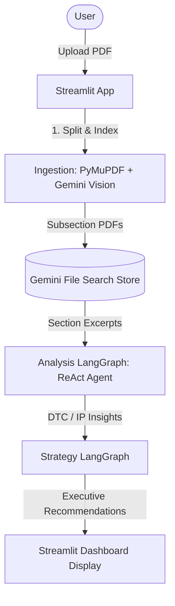
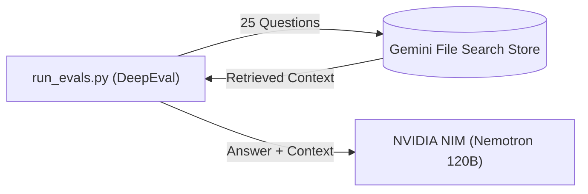

# Music Analytics Pipeline: Agentic AI Implementation

---

## Table of contents

- [Project overview](#project-overview)
- [LLM usage (Gemini)](#llm-usage-gemini)
- [Tech stack](#tech-stack)
- [Repo layout](#repo-layout)
- [End-to-end flow](#end-to-end-flow)
- [Ingestion and manifest](#ingestion-and-manifest)
- [Graphs, nodes, and agents](#graphs-nodes-and-agents)
- [Analysis LangGraph](#analysis-langgraph)
- [Strategy LangGraph](#strategy-langgraph)
- [Streamlit demo surface](#streamlit-demo-surface)
- [Evaluation](#evaluation)
- [Reference](#reference)
  - [Config](#config)
  - [LCEL chains](#lcel-chains)
  - [Services (key modules)](#services-key-modules)

---


## Project overview

**Goal:** Demo agentic AI for music-industry reporting: LLM-powered, grounded analysis and C-suite recommendations from a real industry PDF.

**Input:** Music industry report (PDF).

**Live demo:** [music-agentic-analytics.streamlit.app](https://music-agentic-analytics.streamlit.app/) (Streamlit Community Cloud)  
**Local entry:** `python scripts/run.py` -> `app/streamlit_app.py`

All analysis and strategy text is produced by LLMs. There are no rule-based insight generators or title heuristics. Classification, summarization, retrieval synthesis, agent reasoning, and executive recommendations each call Gemini with structured prompts.

### Tech stack


| Layer         | Technology                      | Role                                                                                    |
| ------------- | ------------------------------- | --------------------------------------------------------------------------------------- |
| UI            | Streamlit                       | Upload PDF, run analysis + strategy, live timer, ReAct trace, executive cards           |
| Env           | `python-dotenv`                 | `GEMINI_API_KEY`, `NVIDIA_API_KEY`, model overrides                                     |
| LLM provider  | Google Gemini                   | Summarization, classification, retrieval synthesis, agent reasoning, strategy           |
| Eval judge    | NVIDIA NIM                      | Nemotron-3 Super (120B). Used only by `src/validation/evals/run_evals.py`               |
| Documents     | Gemini File Search              | Per-subsection PDFs indexed with metadata (`source_filename`, `subsection_key`)         |
| PDF structure | PyMuPDF + Gemini vision         | `section_splitter.py`: LLM reads page images to find subsection boundaries              |
| LLM (chains)  | `langchain-google-genai`        | LCEL chains: summaries, batch labels, strategy text                                     |
| Agents        | `langchain.agents.create_agent` | ReAct analysis agent: LLM selects tools and drives the dev profile loop                 |
| Orchestration | LangGraph                       | `analysis_graph.py`, `strategy_graph.py`: wires LLM and deterministic workflow nodes    |
| Evaluation    | DeepEval                        | Hand-run retrieval-and-answer scores: Faithfulness, Answer Relevancy, Contextual Recall |
| Tests         | pytest (`src/validation/`)      | No network; mocks for graph and ReAct (59 tests)                                        |


### Repo layout

```text
app/
  streamlit_app.py            # Demo UI (executive layout, custom CSS, theme-aware)
docs/                         # Documentation + sample PDFs
scripts/
  run.py                      # Streamlit launcher
  create_file_search_store.py # CLI utility to initialize Gemini File Search store offline
.streamlit/
  config.toml                 # Theme + upload limit
src/
  config/                     # RunProfile, AnalysisMode
  graphs/                     # analysis_graph, strategy_graph, state
  agents/
    analysis/                 # Graph nodes + ReAct agent/tools/trace
    strategy/                 # Strategy graph nodes + postprocess
  chains/                     # LCEL chains: summaries, labels, strategy
  pipelines/                  # run_analysis, run_strategy facades
  services/                   # File Search, splitter, cache, bundle
  tools/                      # retrieve_subsection_evidence_tool
  validation/                 # pytest unit tests (no network)
    evals/                    # run_evals.py, questions, results, manual_review.json
      archive/                # superseded section-locked baseline; exits if run
requirements.txt              # Core application and Streamlit dependencies
requirements-eval.txt         # DeepEval + OpenAI client; not installed with the app
```

---


## LLM usage (Gemini)

Every intelligent step in an app run is driven by an LLM. The evaluation judge is documented under [Evaluation](#evaluation); it does not run inside the app.


| Path                                                        | Used for                                                           |
| ----------------------------------------------------------- | ------------------------------------------------------------------ |
| `google-genai` SDK (`genai.Client`)                         | PDF vision split, File Search retrieval (RAG over subsection PDFs) |
| `langchain-google-genai` package (`ChatGoogleGenerativeAI`) | Summaries, labels, ReAct agent, strategy generation                |


### Where LLMs run


| Stage                    | Module                           | Model (default)         | What the LLM does                                                                                 |
| ------------------------ | -------------------------------- | ----------------------- | ------------------------------------------------------------------------------------------------- |
| **PDF structure**        | `section_splitter.py`            | `gemini-3.1-flash-lite` | Vision over rendered pages: detect subsection titles and page ranges                              |
| **Evidence retrieval**   | `file_search_retrieval.py`       | `gemini-3.1-flash-lite` | File Search RAG: pull grounded excerpts from indexed subsection PDFs. Default is `FALLBACK_MODEL` |
| **Neutral summaries**    | `section_summary_chain.py`       | `gemini-3.5-flash-lite` | 3-4 bullet executive summary from retrieved evidence (full path + ReAct tool)                     |
| **Batch classification** | `section_label_chain.py`         | `gemini-3.5-flash-lite` | JSON label each summarized row as DTC / IP / OTHER (full profile only)                            |
| **ReAct agent**          | `react_agents.py`                | `gemini-3.5-flash-lite` | Agent loop: choose subsections, call tools, decide when to finish                                 |
| **Per-row judge**        | `section_label_single_chains.py` | `gemini-3.5-flash-lite` | Classify one subsection for DTC/IP fit (ReAct judge tools)                                        |
| **Label validator**      | `section_label_single_chains.py` | `gemini-3.5-flash-lite` | Second-pass ACCEPT/REJECT on judge output before accepting a row                                  |
| **Strategy brief**       | `strategy_chain.py`              | `gemini-2.5-pro`        | Markdown executive recommendations from the analysis bundle                                       |


**Model resolution:** Models are resolved in this exact order: explicit `model_name` argument > stage's env var > `FALLBACK_MODEL`. If none are set, the app raises a `RuntimeError`.

### Environment variables


| Variable               | Required  | Affects                                                            |
| ---------------------- | --------- | ------------------------------------------------------------------ |
| `GEMINI_API_KEY`       | Yes       | All Gemini calls                                                   |
| `NVIDIA_API_KEY`       | Eval only | Evaluation judge only. The app does not read it                    |
| `FALLBACK_MODEL`       | Yes       | Vision split, retrieval, and any stage whose own variable is unset |
| `ANALYSIS_MODEL`       | No        | LangChain analysis chains + ReAct agent                            |
| `STRATEGY_MODEL`       | No        | Strategy chain                                                     |
| `EVAL_RETRIEVAL_MODEL` | No        | Eval retrieval only. Default `FALLBACK_MODEL`                      |
| `EVAL_GENERATOR_MODEL` | No        | Eval answers only. Default `ANALYSIS_MODEL`                        |
| `EVAL_JUDGE_MODEL`     | Eval only | Eval judge only. Default `nvidia/nemotron-3-super-120b-a12b`       |
| `PIPELINE_RUN_PROFILE` | No        | Run profile. `dev`, `1`, `true`, `yes`, `on` force DEV mode        |


---


## End-to-end flow




**Demo profile:** The app uses a ReAct agent to process subsections one at a time until it finds one that matches the user's chosen focus (DTC or IP).  
**Full profile:** An internal mode that processes every subsection in parallel and batch-labels them all.

---


## Ingestion and manifest

1. User uploads a full report PDF (max 100 MB).
2. `split_pdf_into_dynamic_slices` renders pages to PNG at 110 DPI, asks Gemini vision for subsection titles and page ranges, and emits one mini-PDF per subsection.
3. `ensure_sections_in_store_from_bytes` uploads each slice to File Search with metadata. It waits for indexing to finish, polling every 5 seconds with a 300-second timeout.
4. The section list is cached on disk (`section_cache.json`) using the key format `<pdf_hash>:dynamic:sec_v4`.

**Cloud notes:** On Streamlit Community Cloud, the ephemeral disk deletes `section_cache.json` on restart. When this cache miss occurs, the app re-splits the PDF on the next run. To prevent orphaned documents and storage bloat in Gemini File Search, `ensure_sections_in_store_from_bytes` automatically queries the store and prunes prior slice documents matching the source file via `client.file_search_stores.documents.delete()` before uploading the new slices.

---


## Graphs, nodes, and agents

- Graph = the workflow container (state + nodes + edges)
- Node = a function; can contain an agent or just deterministic code
- Agent = LLM-powered actor working toward a goal; lives inside a node

The app has two graphs, each mixing agent nodes with deterministic nodes:


| Graph                  | Agent node(s)                                                                                                                                          | Deterministic nodes                                              |
| ---------------------- | ------------------------------------------------------------------------------------------------------------------------------------------------------ | ---------------------------------------------------------------- |
| Analysis (dev branch)  | `dtc_react_node` / `ip_react_node` / `both_react_node`: ReAct agent; tool-calling loop (list subsections -> fetch -> judge -> finish)                  | `filter_manifest`, `react_mode_router`, `assemble_outputs_react` |
| Analysis (full branch) | `summarize_subsection`, `label_sections`: structured agents; single-shot LLM summarization/classification, no tool loop                                | `parallel_router`, `assemble_outputs`                            |
| Strategy               | `generate_strategy`: structured agent; goal-directed structured output (executive recommendations), with a conditional retry loop via `grounded_check` | `build_bundle`, `parse_and_dedupe`, `grounded_check`             |


### What data moves between nodes

**Analysis state** (`AnalysisState` in `src/graphs/state.py`):


| Field                                                     | Direction   | Contract                                                                                                                                                 |
| --------------------------------------------------------- | ----------- | -------------------------------------------------------------------------------------------------------------------------------------------------------- |
| `file_search_store_name`, `source_filename`               | Input       | Store resource name, and the `source_filename` metadata value that scopes retrieval                                                                      |
| `manifest`                                                | Input       | Ordered `{subsection_key, display_title}` rows from ingestion                                                                                            |
| `pdf_hash`                                                | Input       | Required; part of the neutral summary cache key                                                                                                          |
| `gemini_model_name`                                       | Input       | Retrieval model, resolved from `FALLBACK_MODEL`                                                                                                          |
| `synthesis_model_name`                                    | Input       | Model for summaries, labels, judge, validator, and the agent, resolved from `ANALYSIS_MODEL`                                                             |
| `run_profile`, `analysis_mode`                            | Input       | See the tables above                                                                                                                                     |
| `react_trace_callback`                                    | Input       | Optional callable that receives live trace rows                                                                                                          |
| `neutral_rows`, `judged_rows`, `react_messages`, `errors` | Accumulated | Lists merged across nodes with `operator.add`                                                                                                            |
| `labeled_rows`                                            | Output      | Rows the UI displays. In `DEV_ONE_PER_CATEGORY`, only the capped accepted rows                                                                           |
| `dtc_results`, `ip_results`                               | Output      | `{insights, evidence_by_section}`. `insights` joins one `### title` block plus summary per row; `evidence_by_section` maps each title to its raw excerpt |
| `section_results`                                         | Output      | `OTHER` rows as `{title: {summary, evidence}}`                                                                                                           |
| `timings`                                                 | Output      | Per-node durations and counters                                                                                                                          |


**Strategy state** (`StrategyState` in `src/graphs/state.py`):


| Field                                          | Direction       | Contract                                                         |
| ---------------------------------------------- | --------------- | ---------------------------------------------------------------- |
| `dtc_results`, `ip_results`, `section_results` | Input           | Analysis outputs as dicts                                        |
| `analysis_bundle`                              | Input, optional | Pre-built bundle text; when present, `build_bundle` does nothing |
| `model_name`                                   | Input, optional | Model override; otherwise `STRATEGY_MODEL`                       |
| `raw_markdown`                                 | Internal        | Raw output of the strategy chain                                 |
| `grounded_retry_count`, `needs_regenerate`     | Internal        | Retry control for `grounded_check`                               |
| `recommendations`                              | Output          | List of `{title, insight, evidence, action}`                     |
| `timings`                                      | Output          | `generate_strategy_s`, `parse_dedupe_s`                          |


---


## Analysis LangGraph

Implemented in `src/graphs/analysis_graph.py`.

**Shared start:** `filter_manifest` -> full manifest (no pre-filter by title; dev reduction happens after ReAct judging).

**Branch on** `run_profile`**:**

### Full profile (`RunProfile.FULL`)

Not exposed in the demo UI. Still available via API, env (`PIPELINE_RUN_PROFILE=full`), or tests.

```text
parallel_router
  -> summarize_subsection (parallel, neutral evidence + summary, disk cache)
  -> label_sections (batch LLM: DTC / IP / OTHER per row)
  -> assemble_outputs
```

- Labeling: `section_label_chain.label_neutral_rows_with_synthesis`


### Dev profile (`RunProfile.DEV_ONE_PER_CATEGORY`)

Hardcoded in Streamlit (`_analysis_profile = RunProfile.DEV_ONE_PER_CATEGORY`). Demo UI offers DTC only or IP only; combined mode is shown disabled.

```text
react_mode_router
  -> dtc_react_node | ip_react_node | both_react_node
  -> assemble_outputs_react
```

**ReAct agent** (`react_agents.py` via `langchain.agents.create_agent` + `react_tools.py`):

- Tools: list subsections, fetch+summarize subsection, judge (DTC / IP / DTC+IP), finish
- Judge + validator chains in `section_label_single_chains.py`
- Live + final trace in Streamlit (`trace_formatter.py`)
- **Recursion limit:** `max(30, 8 * subsection_count)`. When hit, judged rows are kept, unjudged rows are backfilled as `OTHER`, and an error is recorded.

**Evidence retrieval** (`retrieve_subsection_evidence`):

- **Parameters:** `top_k` 12, temperature 0.
- **Retries:** A 429 rate-limit error gets up to 3 attempts, waiting the server's suggested delay (6 seconds if none is given) plus 1 second between attempts. Empty or "not found" replies are retried once.

**Dev assembly rules** (`assemble_outputs_react_node`):


| Mode     | Success               | Failure                                                         |
| -------- | --------------------- | --------------------------------------------------------------- |
| DTC only | >= 1 accepted DTC row | Hard fail (no fallback bundle)                                  |
| IP only  | >= 1 accepted IP row  | Hard fail                                                       |
| Both     | >= 1 DTC and >= 1 IP  | Partial OK: show what was found + warning if one target missing |
| Both     | Neither target        | Hard fail                                                       |


Output is capped to one row per target category (not three-way DTC/IP/OTHER sampling).

**Inputs:** File Search store name, source filename, manifest, `pdf_hash` (for neutral summary cache), `run_profile`, optional `analysis_mode`.

**Outputs:**

- `dtc_results` / `ip_results`: `{ insights, evidence_by_section }` built from labeled neutral rows
- `section_results`: OTHER-labeled subsections
- `neutral_labeled_rows` / labels for UI
- Dev: `react_messages` trace; warnings on partial Both-mode success

---


## Strategy LangGraph

Implemented in `src/graphs/strategy_graph.py`.

```text
build_bundle -> generate_strategy -> parse_and_dedupe -> grounded_check (optional retry)
```

- `generate_strategy` is the structured agent node here: LLM-powered, goal-directed output (executive recommendations). `build_bundle`, `parse_and_dedupe`, and `grounded_check` are deterministic (assemble inputs, parse markdown, dedupe, route).
- **Input bundle** (`strategy_bundle.py`): concatenated **DTC** and **IP** insight text only; no OTHER sections, no raw evidence in the bundle. This is a deliberate two-tier design: the strategy brief targets executive stakeholders who require concise, synthesized insights rather than multi-page excerpt dumps. Verbatim source excerpts remain fully accessible in the Analysis layer for citation backtracing.
- In dev mode, bundle reflects whichever categories the ReAct pass accepted (e.g. DTC-only run -> DTC block only).
- **Postprocess** (`postprocess.py`): 
  - **Parse:** Regex extraction per field, with a fallback split on `Title:` when headers are missing.
  - **Dedupe:** A recommendation is dropped when its word-token Jaccard similarity with an already kept one is 0.42 or more (or 0.22 or more when they share a capitalized term).
  - **Check:** Counts recommendations whose title, insight, and evidence are all non-empty. If there are fewer than 3, it triggers one regeneration with a prompt nudge to fill in Evidence and Action.
- **Output:** 3-5 recommendations (`title`, `insight`, `evidence`, `action`) shown in Streamlit.

**Inputs:** Analysis dicts or pre-built `analysis_bundle` string.

**Behavior:** Executive recommendations with evidence tied to report content; check node may trigger one regeneration.

---


## Streamlit demo surface

Implemented in `app/streamlit_app.py`.

### Layout and design

- **Hero:** eyebrow, title, description, tech stack line (`Streamlit -> Gemini File Search -> LangGraph -> LangChain -> Gemini LLM`)
- **Two-column top row:** Configure (left) · Workspace (right), both in bordered containers
- **Two-column bottom row:** Insights (left) · Recommendations (right)
- **Custom CSS:** warm cream/orange palette, Google Sans/Roboto, card-based insight and recommendation UI
- **Dark mode:** `.streamlit/config.toml` light/dark themes + CSS variables synced via `st.context.theme` (auto-rerun on theme change)


### Demo behavior


| Control                   | Behavior                                                                                                             |
| ------------------------- | -------------------------------------------------------------------------------------------------------------------- |
| Strategic focus           | Radio: Fan & audience (DTC) or Catalog & IP (required before run)                                                    |
| Combined DTC+IP           | Checkbox shown disabled ("resource limits")                                                                          |
| Run profile               | Always `DEV_ONE_PER_CATEGORY`; no dev/full toggle                                                                    |
| Run analysis              | Disabled until focus + PDF selected; primary button with live progress                                               |
| Live timer                | Elapsed time shown during analysis and strategy runs                                                                 |
| ReAct trace               | Streamed live during run; persisted in "How the AI reached these insights" expander                                  |
| Generate executive brief  | Runs strategy graph; disabled until analysis bundle has content                                                      |
| Download run audit (JSON) | Writes a local snapshot via `src/services/audit_pack.py`: mode, timings, labeled rows, insights, and the ReAct trace |


### Results display

- **Insight cards** with evidence expanders (DTC and/or IP depending on mode used)
- **Section classification detail** expander (labeled rows)
- **Recommendation cards** with title, insight, evidence, action
- **Session state** cleared on new PDF upload


### Timings and Telemetry

- **Analysis** (`last_summarize_timings`): `vision_split_file_search_s`, `summarize_classify_wall_s`, `dynamic_pipeline_wall_s`, and the graph's own timings, such as `react_<mode>_s`, `react_recursion_limit`, `react_message_count`, `react_rows_before_drop`, `react_rows_after_drop`, `react_rows_after_mode_cap`, `bundle_shape_s`, and `analysis_graph_wall_s`.
- **Strategy** (`last_strategy_timings`): `strategy_pipeline_s` only. The app does not collect the strategy graph's per-node timings.


### Audit serialization (`src/services/audit_pack.py`)

- Built in memory from session state and downloaded through the browser. Nothing is written to server disk.
- Schema version `1.0`, with these fields: `generated_at`, `app`, `run` (source file, mode, profile, model, timings), `quality_control` (judge and validator note, labeled-row summary), `outputs` (DTC, IP, and strategy results), `react_trace` (step numbers renumbered for display), and `react_trace_plain_english`.
- **Limits:** `run.model` records only the analysis model, not the vision, retrieval, or strategy models. `run.timings` holds the analysis timings only. Tracking for vision splitting, retrieval models, and strategy graph per-node latency is deferred to future schema versions.


### Entry points

- **Production:** [https://music-agentic-analytics.streamlit.app/](https://music-agentic-analytics.streamlit.app/)
- **Local:** `python scripts/run.py` or `streamlit run app/streamlit_app.py`
- `python app/streamlit_app.py` includes a guarded launcher when no Streamlit context exists

**Cloud notes:** `GEMINI_API_KEY` is set in Streamlit Cloud secrets. Ephemeral disk on Cloud means section and neutral-summary caches do not persist across app restarts or redeploys (each session may re-upload subsections to File Search).

---


## Evaluation

`src/validation/evals/run_evals.py` asks 25 questions about the indexed *Luminate 2025 Year-End Music Report* and scores the answers. It evaluates the File Search index the app builds. It does not run the ReAct agent, the DTC/IP judge, or the executive brief.




### Models, limits, and labels


| Piece                | Setting                                                                                                     |
| -------------------- | ----------------------------------------------------------------------------------------------------------- |
| Retrieval model      | `EVAL_RETRIEVAL_MODEL`, default `FALLBACK_MODEL`                                                            |
| Answer model         | `EVAL_GENERATOR_MODEL`, default `ANALYSIS_MODEL`                                                            |
| Judge                | `EVAL_JUDGE_MODEL`, default `nvidia/nemotron-3-super-120b-a12b` via NVIDIA NIM, temperature 0, thinking off |
| Generator rate limit | 12 requests per minute                                                                                      |
| Judge rate limit     | 30 requests per minute                                                                                      |
| Metric pass line     | score >= 0.7 on Faithfulness, Answer Relevancy, and Contextual Recall                                       |
| Manual labels        | `manual_review.json`, counted only when the answer hash matches the reviewed text                           |


`--use-cache` reuses a saved answer when the retrieved text is unchanged. Retrieval still runs live. Cached questions are left out of the latency stats. `--summarize-only` rebuilds the summary with no API calls.

### Testing Report Summary

Source: `src/validation/evals/testing_report.json`, a section-locked run on 2026-10-09 (UTC). Models: retrieval `gemini-3.1-flash-lite`, answers `gemini-3.5-flash-lite`, judge `nvidia/nemotron-3-super-120b-a12b`.


| Metric                        | Result                                                      |
| ----------------------------- | ----------------------------------------------------------- |
| Faithfulness                  | 100% (25/25)                                                |
| Answer Relevancy              | 80% (20/25)                                                 |
| Contextual Recall             | 56% (14/25)                                                 |
| All three metrics passed      | 56% (14/25)                                                 |
| Manual review, answer correct | 56% (14/25); the judge agreed with the reviewer on 25 of 25 |


- **Contextual Recall (56%)** is limited by the 9-bullet excerpt. Scores in this run were all-or-nothing: for 11 of the 25 questions, the excerpt contained none of the reference answer's facts (score 0).
- **Answer Relevancy (80%)**: all 5 failures are among those 11 questions. The generator replied that the context had no such information, and the judge scored that reply as irrelevant.
- **Faithfulness (100%)**: every answer scored 1.0, staying within the retrieved text, refusals included.
- **Bottleneck:** every failure in this run traces back to retrieval coverage, not to answer generation.


### Telemetry

Pipeline latency is the retrieval call plus the answer call, per question.


| Measure                         | Mean         | Median       | p95          |
| ------------------------------- | ------------ | ------------ | ------------ |
| Pipeline (retrieval and answer) | 17,994.12 ms | 15,298.86 ms | 33,315.59 ms |
| Retrieval                       | 10,051.22 ms | 6,742.43 ms  | 27,719.28 ms |
| Answer generation               | 7,942.89 ms  | 7,524.39 ms  | 13,540.43 ms |
| Judge, per question             | 16,409.63 ms | 16,105.99 ms | 21,101.02 ms |


| Spend (list-price estimate, not an invoice) | USD     |
| ------------------------------------------- | ------- |
| Total run                                   | $0.0797 |
| Judge share                                 | $0.0157 |


### Evaluation roadmap

Future benchmarking will expand DeepEval coverage across three distinct evaluation tracks:

- **Strategic synthesis**: Evaluating executive brief actionability, relevance, and fidelity to summarized findings in isolation.
- **Agentic trajectories**: Measuring state transitions, ReAct tool selection accuracy, and retry loop behavior (`grounded_check`) across LangGraph executions.
- **End-to-end evaluation**: Testing the full pipeline from raw PDF ingestion through File Search retrieval, summarization, and final C-suite recommendations against ground-truth report metrics.

---


## Reference


### Config


#### `RunProfile` (`src/config/run_profiles.py`)

- `FULL`: parallel summarize + batch label
- `DEV_ONE_PER_CATEGORY`: ReAct path; requires `analysis_mode`
- Resolution: explicit profile > `dev_mode_flag` > env (`PIPELINE_RUN_PROFILE` or `ANALYSIS_DEV_MODE`)


#### `AnalysisMode` (`src/config/analysis_mode.py`)

- `dtc_only`, `ip_only`, `both`
- Demo UI exposes DTC and IP only; `both` remains in graph/tests but is disabled in UI


### LCEL chains


| File                             | Purpose                                                    |
| -------------------------------- | ---------------------------------------------------------- |
| `section_summary_chain.py`       | Neutral 3-4 bullet summary from EARLY/MIDDLE/LATE evidence |
| `section_label_chain.py`         | Batch JSON labeling (DTC/IP/OTHER) for full parallel path  |
| `section_label_single_chains.py` | Per-row judge + validator chains for ReAct tools           |
| `strategy_chain.py`              | Markdown strategy recommendations from analysis bundle     |


### Services (key modules)


| Service                    | Role                                                                      |
| -------------------------- | ------------------------------------------------------------------------- |
| `file_search_store.py`     | Upload subsection PDFs; disk cache keyed by pdf hash                      |
| `file_search_retrieval.py` | Metadata-scoped File Search; EARLY/MIDDLE/LATE excerpts                   |
| `section_splitter.py`      | Vision-based dynamic PDF split (only path)                                |
| `manifest_filter.py`       | Pass-through manifest; dev cap via `limit_labeled_rows_one_per_category`  |
| `section_categories.py`    | `DTC`, `IP`, `OTHER` constants                                            |
| `strategy_bundle.py`       | Build result dicts + strategy bundle text (DTC + IP only)                 |
| `section_cache.py`         | PDF hash -> store name, doc names, manifest                               |
| `neutral_summary_cache.py` | Always-on disk cache for neutral summaries                                |
| `audit_pack.py`            | JSON download of one demo run: mode, timings, rows, insights, ReAct trace |


